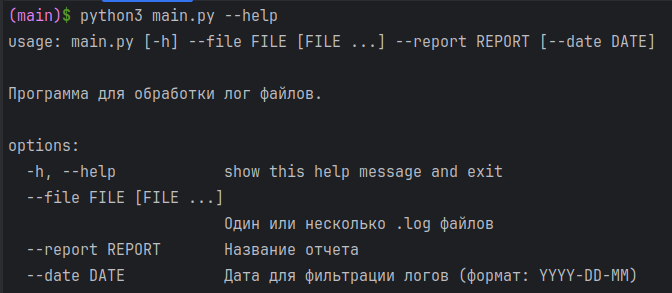
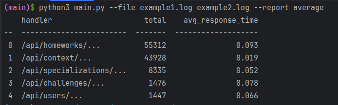
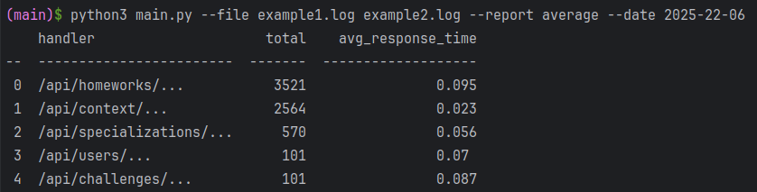
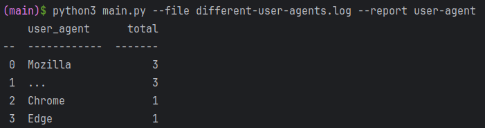
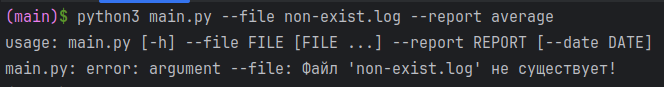
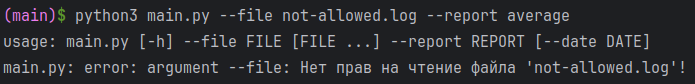
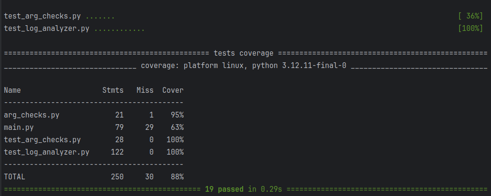

# wm-test


#### 🍋‍🟩 Основные запуски 


Информация по скрипту: 




Базовое задание: 




Отчет с фильтрацией по датам (**бонусное**): 




Отчет по популярности `user-agent` (**бонусное** как пример масштабирования скрипта, очень простенький)




#### 🍋‍🟩 Как добавлять новые отчеты?

Я добавил `user-agent`, и оставил заготовку для `max`. Посмотрим на неё :)

Сначала добавляем в список проверки аргументов в `arg_checks.py`: 

```python
AVAILABLE_REPORTS = ['average', 'user-agent', 'max']
```

Далее добавляем в инициализатор класса `LogAnalyzer`: 

```python
self._grab_methods = {  
    'average': self._grab_by_average,  
    'user-agent': self._grab_by_user_agent,  
    'max': self._grab_by_max # тут!
}  
  
self._report_generators = {  
    'average': self._generate_average_report,  
    'user-agent': self._generate_user_agent_report,  
    'max': self._generate_max_report, # и тут! 
}
```

И ниже в этом же классе пропишем реализацию: 

```python
def _grab_by_max(self, stats, log_entry):  
    raise NotImplementedError("Отчёт 'max' в разработке") 


def _generate_max_report(self, stats):  
    ...
```


Потенциально слабое место, можно было реализовать все проверки здесь же в классе `LogAnalyzer` и тем самым скучковать возможные варианты репортов в одном месте. Но я решил воспользоваться встроенным `type` у `argparse`. 

Вроде получается масштабировать, не переписывая половину скрипта :)


#### 🍋‍🟩 Кривые запуски: 

Например, если нет файла: 



Или нет разрешения на чтение: 



Все проверки можно посмотреть в `arg_checks.py`


#### 🍋‍🟩 Тесты: 

общее покрытие 88%



Все критические части покрыты как и требовалось по ТЗ. На `main.py` маленький процент из-за того, что я сознательно не покрывал бонусную часть тестами (она плюс-минус такая же как основная). А код оставил для показа масштабируемости :)

#### 🍋‍🟩 Что можно добавить? 

- Сохранение отчёта в файл или бд
- Сортировку отчёта по нужному ключу
- И т.д...


